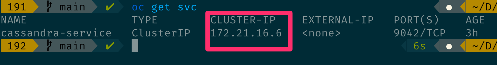

# Build a new JanusGraph Docker image that works with OpenShift as well as Kubernetes

The Docker image for JanusGraph from the project's official repo deploys successfully into Kubernetes but runs into errors when deployed into OpenShift. There are few changes that need to be made to the Dockerfile to build an image can be deployed successfully in both Kubernetes and OpenShift. This document explains what to do.

## IBM Developer articles

This process incorporates best practices from [Design, build, and deploy universal application images](https://developer.ibm.com/learningpaths/universal-application-image/), specifically [Best practices for designing a universal application image](https://developer.ibm.com/learningpaths/universal-application-image/design-universal-image/), which discusses practices applied to Dockerfiles. Consult those articles for an explanation of why these changes to the JanusGraph Dockerfile are necessary.

This universal JanusGraph image is used in the series [Get started using Kubernetes Operators](https://developer.ibm.com/learningpaths/kubernetes-operators/), specifically the "Develop and deploy an advanced Kubernetes operator for JanusGraph" articles that begin with [Develop and deploy a Level I JanusGraph Operator using BerkeleyDB](https://developer.ibm.com/learningpaths/kubernetes-operators/develop-deploy-advanced-operator-janusgraph/develop-janusgraph-operator-berkeleydb/). Check those out to learn how to develop a Kubernetes operator for JanusGraph (that also runs in OpenShift) and to see how it uses the JanusGraph image built with this Dockerfile.

## Fork the repo
To modify the Dockerfile from the JanusGraph project, first fork the [JanusGraph Docker repo](https://github.com/JanusGraph/janusgraph-docker).

## Change the file and group ownership

[Change the file and group ownership](https://developer.ibm.com/learningpaths/universal-application-image/design-universal-image/#6-set-group-ownership-and-file-permission) to root (0) for related folders. The following modifications apply to the `Dockerfile`:

```bash
chgrp -R 1001:0 ${JANUS_HOME} ${JANUS_INITDB_DIR} ${JANUS_CONFIG_DIR} ${JANUS_DATA_DIR} && \
chmod -R g+w ${JANUS_HOME} ${JANUS_INITDB_DIR} ${JANUS_CONFIG_DIR} ${JANUS_DATA_DIR}

RUN chmod u+x /opt/janusgraph/bin/gremlin.sh
RUN chmod u+x /opt/janusgraph/conf/remote.yaml
```


## Configure JanusGraph to use Cassandra instead of BerkeleyDB for persistence

> NOTE: For BerkeleyDB storage you don't need to change the `JANUS_PROPS_TEMPLATE` variable and create a `janusgraph-cql-server.properties` file. The instructions below are ONLY for use with Cassandra.

* Change the `JANUS_PROPS_TEMPLATE` property value to `cql`. This specifies to use Cassandra as the back end database.
* Create a `janusgraph-cql-server.properties` file in the latest version directory (which in this case is `0.5`) and add the following properties:

```bash
gremlin.graph=org.janusgraph.core.JanusGraphFactory
storage.backend=cql
storage.hostname=cassandra-service
storage.username=cassandra
storage.password=cassandra
storage.cql.keyspace=janusgraph
storage.cassandra.replication-factor=3
storage.cassandra.replication-strategy-class=org.apache.cassandra.locator.NetworkTopologyStrategy
cache.db-cache = true
cache.db-cache-clean-wait = 20
cache.db-cache-time = 180000
cache.db-cache-size = 0.5
storage.directory=/var/lib/janusgraph/data
index.search.backend=lucene
index.search.directory=/var/lib/janusgraph/index
```

These properties configure JanusGraph to connect to Cassandra and use it to store its data. Whereas the default database, BerkeleyDB, runs in a single container, Cassandra runs in a cluster of containers.

Also, update the `storage.hostname` property in the `janusgraph-cql-server.properties` file with the IP address for the Cassandra service. The IP address for Cassandra running in a Kubernetes cluster is shown as the Kubernetes service's `Cluster-IP` property. You can find that property in an OpenShift cluster by running the `oc get svc` command, as shown here:



## Build and push JanusGraph docker image

* Since you will only be using the latest version, change the version to the latest in `build-images.sh`. You will create a copy of that file to `build-images-ibm.sh` and modify it there. These modifications include commenting out a few lines. The following modifications are applied to the build script:

```bash
# optional version argument
version="${1:-}"
# get all versions
# versions=($(ls -d [0-9]*))
# get the last element of sorted version folders
# latest_version="${versions[${#versions[@]}-1]}"

# override to run the latest version only:
versions="0.5"
latest_version="0.5"
```

Now you can build and deploy the JanusGraph Docker image to OpenShift by running the following command.
> NOTE: modify the docker image name in the script: `IMAGE_NAME="<your docker image repository>"`

```bash
$ ./build-images-ibm.sh -- if you have created a new file
```

or...

```bash
$ ./build-images.sh -- if you have modified the file provided by JanusGraph
```